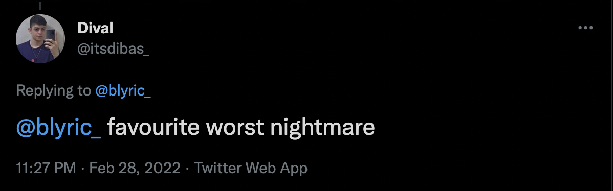
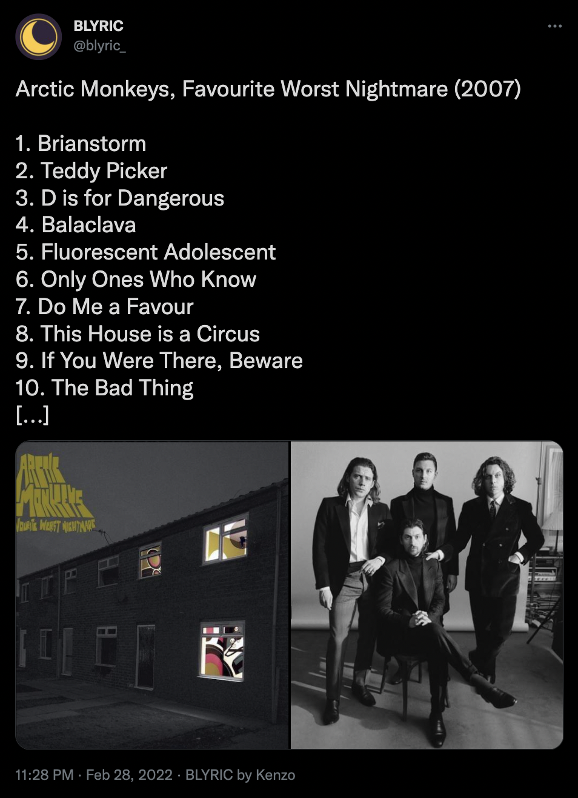

# BLYRIC

BLYRIC, a bot that tweets a song lyric every night.

Follow on Twitter: [@blyric_](https://twitter.com/blyric_)

# Overview

BLYRIC is a Twitter bot that tweets a song quote every night. Users can request new albums to be registered and compose the lyrics base.

Here's an example of a daily tweet:

You can mention BLYRIC on a tweet to request an album to compose the lyrics base. You can do it just mentioning our username and writing the album name in the same tweet, just like this:

Once tweeted, BLYRIC will search in [Genius website](https://genius.com/) if there is an album like this tweet. If so, it will register this album into the database, and a lyric of this album can be sorted.  
When registered, BLYRIC also tweets the new album that was registered, like this:

