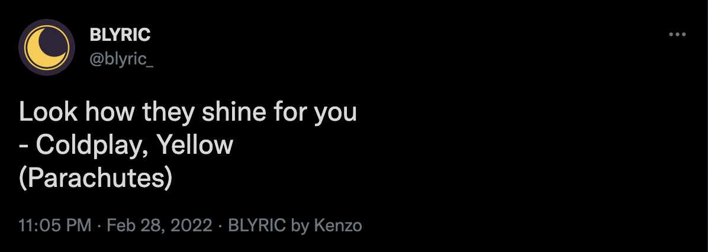

# BLYRIC

BLYRIC, a bot that tweets a song lyric every night.

Follow on Twitter: [@blyric_](https://twitter.com/blyric_)

# Overview

BLYRIC is a Twitter bot that tweets a song quote every night.

Here's an example of a daily tweet:

    

The lyrics are based on [a personal playlist](https://youtube.com/playlist?list=PLUvxQqnky1FdP7rgwqUIsyRYsbl4OW7QO).  
In a future, the idea is to allow users to request their favorite songs to be able to be tweeted by BLYRIC. It was possible in a first draft, but didn't work so well.

# Operation

BLYRIC is coded in Python 3.9.5, and works with Twitter API and Genius API.

Its lyrics data is stored in a Google Sheets, being read and updated by Google Sheets API

It is hosted on [Heroku](https://dashboard.heroku.com), for free.

BLYRIC executes some steps everyday:

- Connect to YouTube API
- Connect to Twitter API
- Conncet to Genius API
- Import the personal playlist
- Tweets the daily lyric
- Send e-mail report
